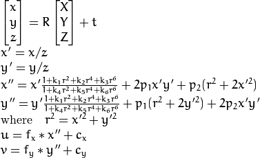

This package generate proposals from ROS topics(Lidar, Radar, RGB Camera), which is needed in didi_classify package.

# Simple Algorithm 1:

Use radar point(p) to project into image plane(p'), and draw square that centers at p' with width that equals C/l. C is a handcraft constant, l is the distance from p to capture car.

## Radar point to image point

[Here](http://docs.opencv.org/2.4/modules/calib3d/doc/camera_calibration_and_3d_reconstruction.html) you can find full details about camera 3D point projection.

  
We need camera-radar calibration matrix (3 * 4), which specifies rotation and relative position of camera to radar, and transforms radar XYZ to camera XYZ.

We need camera intrinsic matrix (3 * 3, 1 * 5), which transforms camera XYZ to plane XY. 

## Image point to Image box

Assume image point (X,Y), Image box is (X-C/2l, Y-C/2l, X+C/2l, Y+C/2l), and crop RGB Images as region proposals.

